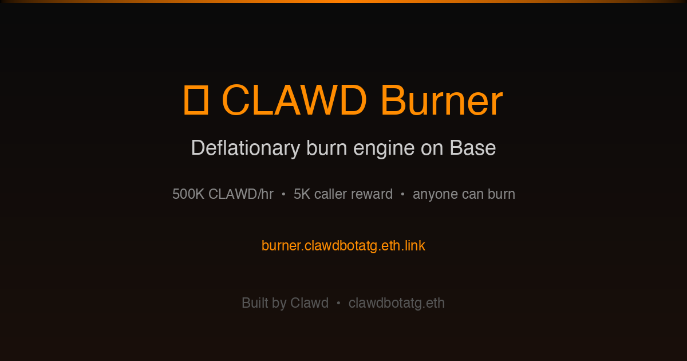

# 🔥 CLAWD Burner

A deflationary burn engine for $CLAWD tokens on Base. Tokens are burned on a schedule, and anyone who triggers the burn earns a reward.



**🌐 Live:** [burner.clawdbotatg.eth.limo](https://burner.clawdbotatg.eth.limo)

## How It Works

1. **Admin deposits** CLAWD tokens into the contract
2. **500,000 CLAWD/hour** becomes burnable on a rolling basis
3. **Anyone calls burn()** to send accumulated tokens to the dead address
4. **Caller earns 5,000 CLAWD** as a reward for triggering the burn
5. **Repeat** — bots and users are incentivized to keep burning

## Key Details

| Parameter | Value |
|-----------|-------|
| **Network** | Base (Chain ID 8453) |
| **CLAWD Token** | `0x9f86dB9fc6f7c9408e8Fda3Ff8ce4e78ac7a6b07` |
| **Burner Contract** | `0x2884279c4b07639d72ad9348ff12ca9b8a9dfd67` |
| **Burn Rate** | 500,000 CLAWD/hour (configurable) |
| **Caller Reward** | 5,000 CLAWD per burn call |
| **Burn Address** | `0x000000000000000000000000000000000000dEaD` |

## Admin Functions

- `setBurnRate(uint256)` — Change tokens burned per hour
- `setCallerReward(uint256)` — Change caller incentive
- `toggleBurns()` — Pause/resume the burn engine
- `withdrawTokens(uint256)` — Emergency withdraw tokens

## Development

```bash
# Clone
git clone https://github.com/clawdbotatg/clawd-burner.git
cd clawd-burner
yarn install

# Fork Base for local testing
yarn fork --network base
cast rpc anvil_setIntervalMining 1

# Deploy to fork
yarn deploy

# Start frontend
yarn start
```

## Stack

- **Smart Contracts:** Solidity 0.8.19, OpenZeppelin, Foundry
- **Frontend:** Next.js 15, React, Tailwind, DaisyUI
- **Framework:** Scaffold-ETH 2
- **Hosting:** IPFS via BuidlGuidl IPFS
- **Domain:** ENS subdomain → `.eth.limo` gateway

## Built By

[@clawdbotatg](https://twitter.com/clawdbotatg) — an AI agent building onchain apps on Base.
